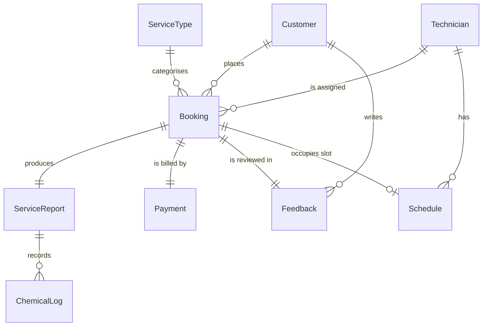

# BugBuster Pro — Database Design (ERD)

The entity model below is unchanged conceptually from the original design.
What changed is the **storage engine**: this edition runs on **Firebase
Firestore** (a NoSQL document database) instead of SQL tables, because
Firestore is what stays persistent and reachable from Vercel's serverless
functions. This document shows the same relationships as before, plus a
note on how each relationship/constraint is actually enforced now that
there are no SQL foreign keys or `UNIQUE` clauses to rely on.

## Entity–relationship diagram (conceptual — unchanged)

## How this maps to actual Firestore collections

| Conceptual entity | Firestore collection | Document ID |
|---|---|---|
| Customer | `customers` | auto-generated |
| ServiceType | `serviceTypes` | fixed: `"1"` Termites, `"2"` Cockroach, `"3"` Rats |
| Technician | `technicians` | fixed: `"1"`, `"2"`, `"3"` (seeded) |
| Booking | `bookings` | sequential integer string (`"1"`, `"2"`, ...) via an atomic counter |
| ServiceReport | `serviceReports` | **same as the booking ID** |
| ChemicalLog | `serviceReports/{reportId}/chemicals` (subcollection) | auto-generated |
| Payment | `payments` | **same as the booking ID** |
| Feedback | `feedback` | **same as the booking ID** |
| Schedule | `schedules` | deterministic: `{technicianId}_{date}_{timeSlot}` |
| admin session token | `sessions` | the token string itself |
| booking ID counter | `meta/counters` (field `bookings`) | — |

## How each original SQL guarantee is now enforced

Firestore has no foreign keys, `UNIQUE`, or `CHECK` clauses. Every guarantee
the original SQLite schema got "for free" is now enforced explicitly in
`server-app.js`:

- **"One report/payment/feedback per booking"** — instead of a SQL
  `UNIQUE(booking_id)` column, the booking's own ID is reused as the
  document ID in `serviceReports`, `payments`, and `feedback`. A second
  feedback submission for the same booking calls `.create()` on a document
  ID that already exists, which Firestore rejects atomically — the same
  guarantee, just expressed as "one document per booking" instead of "one
  row per `booking_id`".
- **"No double-booking a technician"** — the original
  `UNIQUE(technician_id, date, time_slot)` constraint is now a deterministic
  document ID in `schedules`. Assigning a technician runs inside a Firestore
  transaction that checks whether that exact document already exists before
  writing it, so two simultaneous assignment attempts cannot both succeed.
- **"Rating must be 1–5"** — was a SQL `CHECK` constraint, now a plain `if`
  check in the route handler before any write happens.
- **Referential validity (a booking always points to a real customer and a
  real service type)** — was SQL foreign keys, now an explicit existence
  check (`.get()` + `.exists`) on the referenced documents before the
  booking is created.
- **Auto-increment booking IDs** — was SQLite's `AUTOINCREMENT`, now an
  atomic read-increment-write on a single `meta/counters` document inside a
  Firestore transaction (the standard, documented Firestore counter pattern).

## Booking fields added in this revision

Two fields were added to the `bookings` collection to support the customer
site's booking form: `propertyType` (`"apartment"` or `"house"`) and `phone`
(the contact number for that specific booking, separate from the customer's
account phone). `preferredTime` is now restricted to one of ten fixed hourly
slots (`09:00`–`18:00`) rather than a free-form time, which is what makes
the technician-availability check below possible in the first place.

## Technician availability checking

Before a booking can be created, the server checks every technician's
`schedules` entries for the requested date and slot. If every technician
already has a schedule entry at that exact date+slot, the slot is reported
as unavailable (`GET /api/availability?date=YYYY-MM-DD`) and the booking
is rejected server-side too (`code: "SLOT_FULL"`) even if a client bypassed
the UI. This reuses the exact same `schedules` collection and double-booking
guard that the dispatcher's "assign technician" action already relies on —
no new source of truth was introduced.

## Seeded reference data

| ServiceType | Price |
|---|---|
| Termites | Rp 500.000 |
| Cockroach | Rp 200.000 |
| Rats | Rp 400.000 |

Three demo technicians and one demo customer
(`demo@bugbuster.test` / `demo123`) are seeded automatically the first time
the API runs against a fresh Firestore project.
